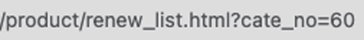

현재 URL 파라미터 값을 구할 땐 loaction.search 를 써준다.

쇼핑몰 상품리스트에서 콘솔창에 location.search 를 입력한 결과.

<div class="content-img">
    
    
</div>

- 정규식 표현을 이용하여 이용한 함수

```javascript
function getParameterByName(name) {
  name = name.replace(/[\[]/, "\\[").replace(/[\]]/, "\\]");
  var regex = new RegExp("[\\?&]" + name + "=([^&#]*)");
  var results = regex.exec(location.search);
  return results == null
    ? ""
    : decodeURIComponent(results[1].replace(/\+/g, ""));
}
```

<em>아..삼항연산자가 자꾸 줄바꿈이 되네..</em>

```javascript
var patId = getParameterByName("cate_no"); // 60
```

<span class="conment">나는 숫자만 뽑아봤다.</span>

```javascript
var getloca = location.search;
var regex = /[^0-9]/g;
var getparm = getloca.replace(regex, "");
console.log(getparm); //60
```

- 파라미터를 객체로 가져오는 함수

```javascript
function get_query() {
  var url = document.location.href;
  var qs = url.substring(url.indexOf("?") + 1).split("&");
  for (var i = 0, result = {}; i < qs.length; i++) {
    qs[i] = qs[i].split("=");
    result[qs[i][0]] = decodeURIComponent(qs[i][1]);
  }
  return result;
}
```

```javascript
var result = get_query(); //result { cate_no: "60", }
```

<a href="https://fellowtuts.com/jquery/getting-query-string-values-in-javascript/?a=a" class="refer">출처</a>
