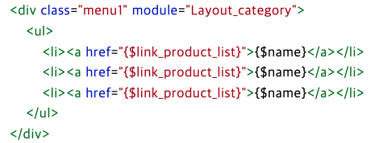

<span class="code-title">a 태그에서 attr() 함수로 href 속성값을 가져와 정규표현식으로 걸러내면 된다.</span>

```javascript
var aurl = $("선택자").attr("href");
console.log(aurl); // href 값
```

<span class="code-desc">
나는 카페24에서 상품분류에 따라 GNB에 ative 효과를 줘야했다.
탭을 내가만들면 좋지만 카페24는 모듈 변수로 GNB리스트를 가져오고 상품분류도 파라미터에 따라 다르게 가져온다.
</span>

<div class="content-img">
    
</div>

<ul class="misson-list">
    <li>1. 현재 페에지 상품분류 파라미터 구하기</li>
    <li>2. each()함수로 반복하여 변수로 가져온 GNB리스트 a태그 파라미터 구하기</li>
    <li>3. 비교해서 엑티브 효과주기</li>
</ul>
<span class="code-title">1. 현재 페이지 상품분류 파라미터 구하기</span>

```javascript
var regex = /[^0-9]/g;
var getloca = location.search;
var getparm = getloca.replace(regex, "");
```

<span class="code-desc">- location.search를 이용해서 현제페이지의 파라미터값을 가져와 정규표현식으로 숫자만 가져왔다.</span>
<span class="code-title">2. each()함수로 반복하여 변수로 가져온 GNB리스트 a태그 파라미터 구하기</span>

```javascript
$(".cate-list li a").each(function () {
  var aurl = $(this).attr("href");
  var aparm = aurl.replace(regex, "");
});
```

<span class="code-desc">
attr()로 url을 가져온 뒤 정규표현식으로 숫자만 가져온다. 다행히 파라미터가 복잡하지 않아 숫자만 가져오면 됐다<br>
each()문으로 리스트들을 가져온다 리스트가 8개이다.</span>

<span class="code-title">3. 비교해서 엑티브 효과주기</span>

```javascript
$(".cate-list li a").each(function () {
  var aurl = $(this).attr("href");
  var aparm = aurl.replace(regex, "");
  if (getparm == aparm) {
    $(".cate-list li a").removeClass("cate-active");
    $(this).addClass("cate-active");
    return false;
  }
});
```

<span class="code-desc">
현재페이지의 파라미터와 리스트의 파라미터를 구했으니 if문으로 비교하여 일치하는 메뉴에 addClass()로 active 효과를 준다.
</span>

```css
.cate-active {
  color: #ef860e !important;
  font-weight: 700 !important;
}
```

<span class="code-desc">스크립트로 CSS를 바꿔주는거 보다 클래스를 줬다뺐다하는게 관리하기 편하다</span>
